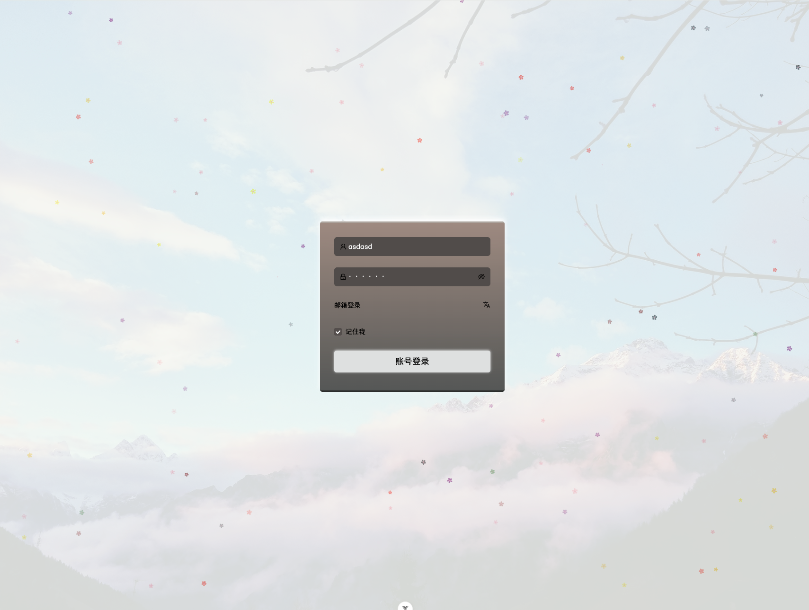
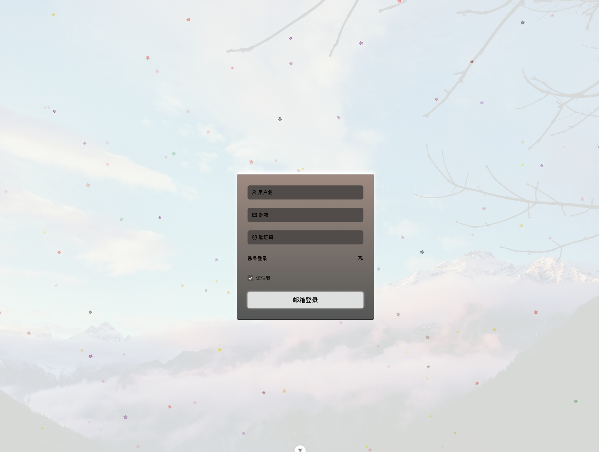
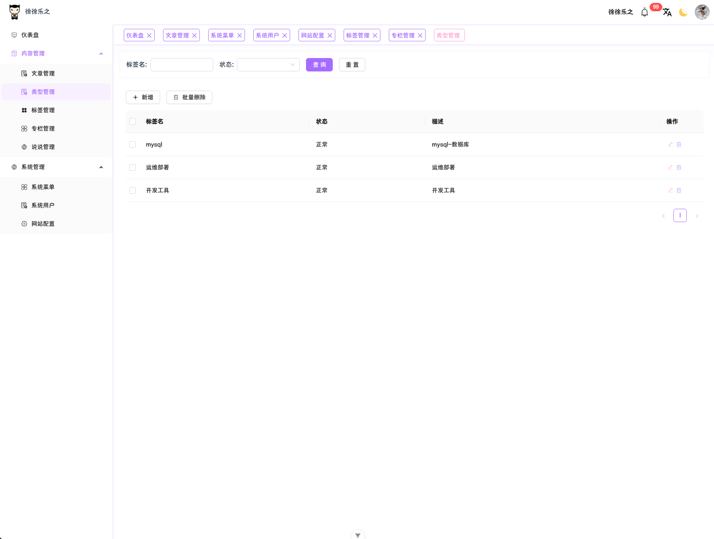
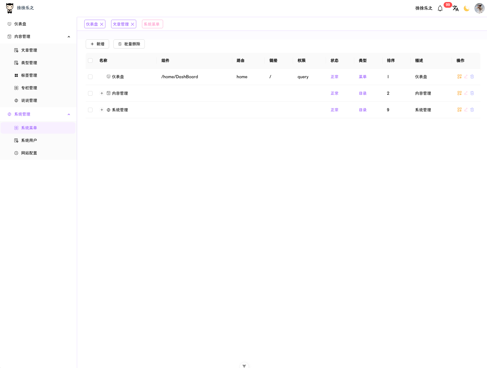
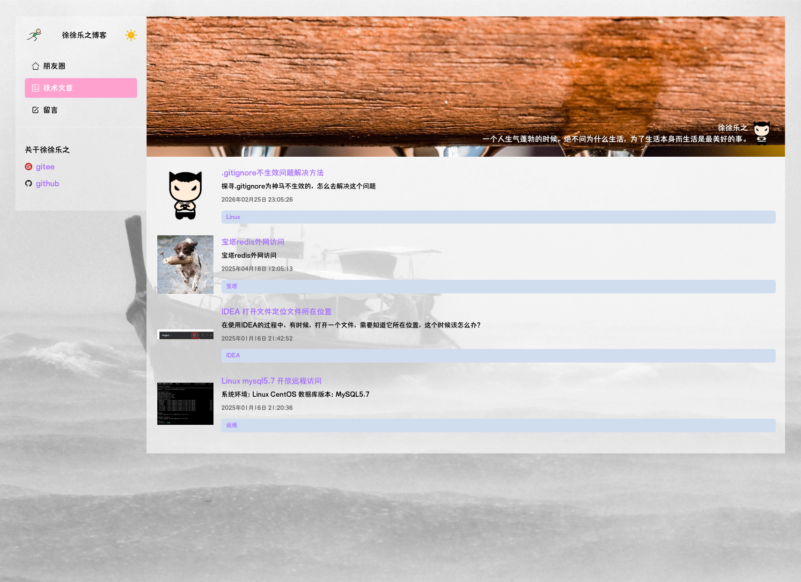
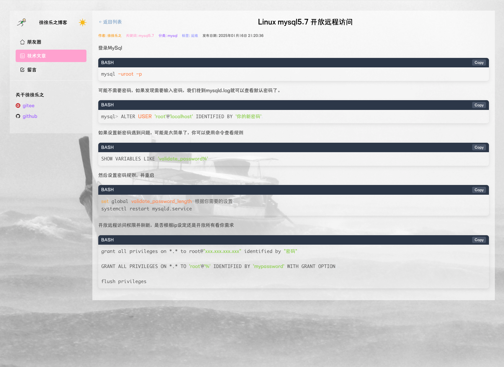

# 徐徐乐之博客与工具集合

\*\*其他语言版本: [中文](README.md) | [English](README_EN.md)\*\*

### 介绍

#### **我的博客诞生记：一行代码，十年执念**‌

还记得大学宿舍里那台风扇轰鸣的旧笔记本吗？当室友在峡谷酣战时，我正对着黑乎乎的终端敲下人生第一个`console.log("Hello Blog!")`。学生时代的博客梦像颗倔强的种子——可服务器费用是堵高墙，免费空间慢得像蜗牛爬 Git 仓库，毕设、求职、加班接踵而至……时间成了最奢侈的变量。

直到 2025 年的某个深夜，当我在代码堆里抬起头，忽然意识到那个执念更鲜活了\*\*‌——这次，我要亲手铸造每个像素
于是这个站点从想象走向现实。

这不是完美作品，而是程序员写给自己的情书：

那些省吃俭用攒云服务的少年
那些通宵调试免费主机的愤懑
终在 2025 年凝结成一行`git push -u origin main`
欢迎走进我的代码宇宙——
此处星光，皆为你亮 ✨

[[体验博客](https://www.lexujia.com/)] | [[后台管理](https://joyadmin.lexujia.com/)] | [[查看源码仓库](https://gitee.com/sirous-black/joy-blog-tools)]
_——每个 Star 都是续写故事的墨水_

#### ⭐ Star

亲爱的访客朋友：

我知道，在代码世界里“下载即走”是常态——你风尘仆仆地搜索简而美的博客站，一把拽走源码，转身投入新的改建战场，像极了当年我写`while(true)`时忘记设退出条件的模样（笑）。

‌‌**但请留步 3 秒钟**‌‌：
当你在深夜调试终于看到`Hello World!`时，可曾想过这个极简引擎为你省下多少试错成本？当界面从“代码废墟”蜕变成“极客美术馆”，是否想起某个优雅的 CSS 方案藏在这儿的抽屉？

你的每一次 🌟‌**Star**‌
▸ 是让「简而美」哲学延续的氧气罐
▸ 是阻止我删库跑路的防暴锁
▸ 更是向世界说：‌**“这个破站，有点东西！”**‌

不必鲜花掌声，只要指尖轻点，让这颗星星照亮更多人的技术夜路 ✨
_——毕竟这个用头发换代码的地方，该有它的星图_

### 软件架构

#### 技术栈


| 客户端(小程序，app) | 客户端(pc)  | 管理端         | 服务端       |
| ------------------- | ----------- | -------------- | ------------ |
| Uni-app x           | React       | Vue3           | Spring boot  |
|                     | Zustand     | Vite           | JDK 1.8      |
|                     | Next        | TS             | Sa-Token     |
|                     | Next-Intl   | Pinia          | Redis        |
|                     | TS          | Vue-i18n       | knife4j      |
|                     | React Query | Vue-router     | MyBatis Plus |
|                     |             | Ant-design-vue | MySQL        |
|                     |             | Axios          |              |
|                     |             | Scss           |              |

#### 安装教程

##### 客户端

> 使用 HBuilder X 在各个平台构建

##### 管理端

> 1. 添加依赖————yarn add
> 2. 开放环境运行——yarn dev
> 3. 生产部署————yarn build

##### 客户端(PC)

> 1. 开放环境运行——yarn dev
> 2. 开放环境运行——HOST=0.0.0.0 PORT=3000 yarn build(麻烦的再下面了，我服务器小，不想装docker来处理，docker简单很多)
>    =====>.next/standalone/ (核心服务)
>    =====>.next/static/ (静态资源)
>    =====>public/ (公共资源)
>    =====>package.json (用于安装生产依赖)
>    =====>.env (环境变量)
>    ღ ੭ღ ੭ღ ੭ღ ੭服务器ღ ੭ღ ੭ღ ੭ღ ੭
>    /var/www/你的项目/
>    ├── server.js       <-- 入口
>    ├── node_modules/
>    ├── package.json   <-- 安装依赖
>    ├── public/        <-- 静态资源
>    └── .env
>    └── .next          <-- 这个目录必须存在
>    yarn install --production
> 3. nginx配置，添加缓存配置
>    全局配置文件里面加上下面的
>
>    ```
>    proxy_cache_path /tmp/存储位置 levels=1:2 keys_zone=名称:10m max_size=1g inactive=10m;
>    include /www/server/panel/vhost/nginx/*.conf;
>    ```
>
>    添加相对应缓存（vhost/nginx/**.nginx）
>
>    ```
>    location / {
>       proxy_cache 名称; 
>       proxy_cache_valid 200 10m;
>       proxy_cache_use_stale error timeout updating http_500 http_502 http_503 http_504;
>       add_header X-Cache-Status $upstream_cache_status;
>       proxy_cache_key "$scheme$request_method$host$request_uri";
>
>       proxy_set_header Host $host;
>       proxy_set_header X-Real-IP $remote_addr;
>       proxy_set_header X-Forwarded-For $proxy_add_x_forwarded_for;
>    }
>    ```

##### 服务端

> 1. 导入 [SQL(请参阅README_SQL.md)](README_SQL.md) 文件到数据库配置数据库连接（application-环境.yml）
> 2. maven 构建
> 3. 启动（Application）
> 4. 配置 nginx

#### 其它

> 1. 在前端 class name 为了和其它三方插件命名同步，命名改成了 exp:test-main
> 2. 因为平台权限需求不高，手撸了个极为简单的权限控制，没有角色表，仅仅是用户，菜单，用户菜单关联表形成了简单的权限控制系统
> 3. 关于为什么客户端(PC)用了React而不是统一使用Vue，因为管理端使用了Vue，为了尽可多使用不同框架技术，所以使用了React
> 4. 原本打算客户端（joy-web）是与服务端坐交互的，现采用的是触发发布博客、朋友圈、留言等触发服务端build JSON,joy-web 读取JSON,提高网站性能。

### 项目截图

#### 后台管理

##### 账号登录



##### 邮箱登录



##### 类型管理



##### 专栏管理


##### 系统菜单



#### 前端博客

##### 文章列表



##### 文章详情


