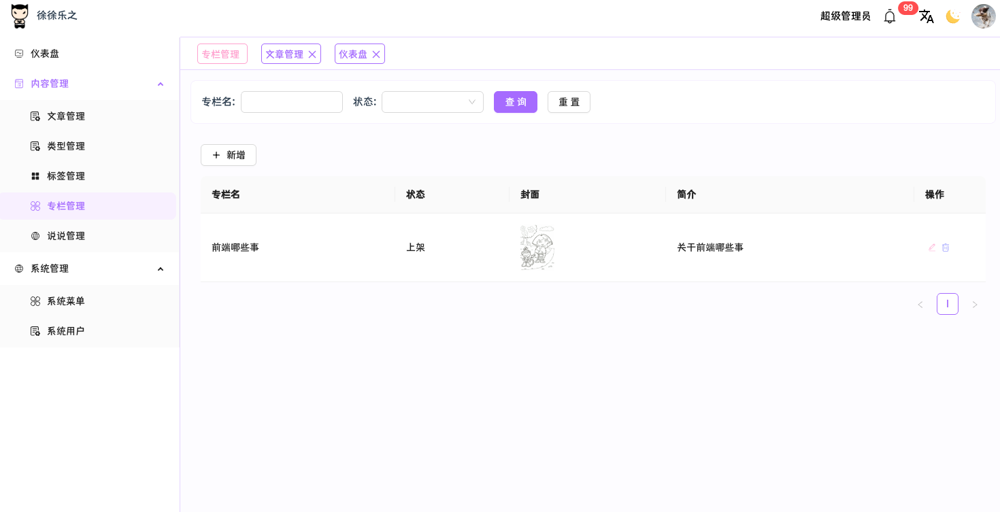

# Joy Blog & Tools

\*\*Other language versions: [中文](README.md) | [English](README_EN.md)\*\*

### Introduction

#### **The Birth of My Blog: One Line of Code, A Decade of Persistence**

Do you remember that old laptop in the dorm room, humming louder than a fan? While my roommates were battling in the Rift, I was typing my first `console.log("Hello Blog!")` in front of a black terminal. The dream of a student blog was like a stubborn seed—but server costs were a high wall. Free hosting was as slow as a snail crawling through a Git repository. Graduation projects, job hunting, and overtime followed one after another... Time became the most luxurious variable.

Until one night in 2025, when I looked up from a pile of code and suddenly realized that obsession was fresher than ever\*\*——this time, I would forge every pixel with my own hands.
Thus, this site moved from imagination to reality:

- **🔨 The Keyboard as Hammer**: Rejecting templates, refining interaction details endlessly.
- **🌙 The Night as Crucible**: Debugging a falling flower animation until the first light of dawn.
- **🔥 Faith as Fire**: When the dark mode glows and navigates, I know the ten-year wait was worth it.

This is not a perfect work, but a love letter from a programmer to himself:

The youth who saved money for cloud services
The frustration of debugging free hosts all night
Finally condensed into a line of `git push -u origin main` in 2025.
Welcome to my code universe——
The starlight here shines for you ✨

[[Experience Blog](https://www.lexujia.com/)] | [Admin Panel] | [[View Source Code Repository](https://github.com/sirius-orion-black/joy-blog-tools)]

_——Every Star is the ink to continue the story_

#### ⭐ Star

Dear visitor,

I know, in the world of code, "download and go" is the norm. You rush through the search for a simple and beautiful blog, grab the source code, and turn to rebuild a new battlefield. It reminds me of the time I wrote `while(true)` without setting an exit condition (laugh).

**But please, pause for 3 seconds**:
When you finally see `Hello World!` at midnight, have you ever thought about how much trial-and-error cost this minimalist engine saved you? When the interface transforms from a "code wasteland" into a "geek art gallery," do you recall that an elegant CSS solution was hidden in this drawer?

Your every 🌟**Star**
▸ Is the oxygen tank that keeps the "Simple & Beautiful" philosophy alive.
▸ Is the anti-blast lock that stops me from deleting the repo and running away.
▸ More importantly, it tells the world: **"This broken site? It's actually something!"**

No need for flowers or applause. Just a tap of your finger, lighting up the technical night road for more people ✨.
——After all, this place, built with hair for code, deserves its own star chart.

### Software Architecture

#### Tech Stack

| Client (Mini-program, App) | Client (PC)     | Admin Panel    | Server       |
| :------------------------- | :-------------- | :------------- | :----------- |
| Uni-app x                  | React           | Vue3           | Spring boot  |
|                            | Zustand         | Vite           | JDK 1.8      |
|                            | React Router v6 | TS             | Sa-Token     |
|                            | React Query     | Pinia          | Redis        |
|                            | TS              | Vue-i18n       | knife4j      |
|                            | Vite            | Vue-router     | MyBatis Plus |
|                            | Axios           | Ant-design-vue | MySQL        |
|                            | react-i18next   | Axios          |              |
|                            |                 | Scss           |              |

#### Installation Guide

##### Client

> Use HBuilder X to build across platforms.

##### Admin Panel & Client (PC)

> 1. Add dependencies ———— `yarn add`
> 2. Run in development ———— `yarn dev`
> 3. Production deployment ———— `yarn build`

##### Server

> 1. Import the SQL file into the database.
> 2. Configure the database connection (`application-environment.yml`).
> 3. Maven build.
> 4. Start (`Application`).
> 5. Configure nginx.

#### Other Notes

> 1. In the frontend, class names were changed to `exp:test-main` to synchronize with other third-party plugin naming conventions.
> 2. Due to low platform permission requirements, I wrote a very simple permission control from scratch. Without a role table, it is simply formed by a user, menu, and user-menu association table.
> 3. Regarding why the Client (PC) uses React instead of unifying with Vue: Since the Admin Panel uses Vue, I chose React to utilize as many different framework technologies as possible.

### Project Screenshots

